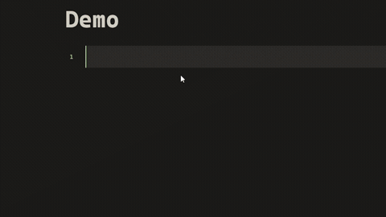

# Discord Emoji Picker


A Discord-style emoji and sticker picker for [Obsidian](https://obsidian.md). It reads images from folders in your vault and lets you insert them into notes — fully offline by default.

## Demo



## Features

- **Emoji & sticker pills** with set navigation, live search, and a "recently used" row.
- **Three insert styles**: shortcode (`:name:`), native embed (`[[image|size]]`), or raw HTML. Shortcodes render as images in the editor and reading mode.
- **Import modal** with a queue: drag & drop or paste links from Discord, local files, clipboard, note embeds, and emoji packs.
- **Clone from Discord servers** using a token — grab emojis and stickers from servers you're in.
- **Set management**: create, delete, and open set folders from the picker, the import modal, and the settings tab.
- **Themable picker**: built-in Default / Compact / Vibrant / Minimal styles, all driven by `--gl-*` CSS variables you can override in a snippet.

## Installation

### Community plugin list

Once approved, install from **Settings → Community plugins → Browse** and search for "Discord Emoji Picker".

### Manual

Copy `main.js`, `manifest.json`, and `styles.css` to:

```
<Vault>/.obsidian/plugins/discord-emoji-picker/
```

Then reload Obsidian and enable the plugin in **Settings → Community plugins**.

## Quick start

1. Put some images in your vault — e.g. `emoji/` and `stickers/` (create them via **Settings → Discord Emoji Picker**; each subfolder becomes a *set*).
2. Open a note, click the smile ribbon icon (or run **Open emoji & sticker picker**) and click an image to insert it.
3. Type `:name:` anywhere to insert by shortcode — autocomplete will kick in.
4. Run **Import emojis & stickers** to pull images from the web, Discord, or local files.

## Settings

| Setting | What it does |
| --- | --- |
| Emoji folder | Vault folder with emoji images; each subfolder becomes a set |
| Sticker folder | Vault folder with sticker images; each subfolder becomes a set |
| Emoji sets / Sticker sets | Create, delete, or open set folders |
| Insert style | Shortcode, embed, or HTML when clicking in the picker |
| Render shortcodes in editor | Show shortcode images in live preview / source mode |
| Emoji size / Sticker size | Grid size in the picker and inserted size |
| Picker theme | Default, Compact, Vibrant, or Minimal |
| Clear recently used | Empties the recently used row in the picker |
| Discord token / Token type / Test connection | Credentials for cloning from Discord servers |

## Documentation

- [Usage guide](docs/usage.md) — every feature, step by step.
- [Troubleshooting & FAQ](docs/troubleshooting.md) — common problems and fixes.

## Security & privacy

- The plugin is **offline by default**: no telemetry, and no network requests except to the public Discord CDN when you import or clone from Discord.
- **Vault access is limited** to the two folders you configure (emoji and sticker folders). The plugin never scans the rest of your vault.
- The **clipboard is only read** when you click **Read clipboard image** in the import modal.
- The **Discord token is stored locally** in this vault's plugin data and is only ever sent to Discord.
- **Using your personal user token violates Discord's Terms of Service** and may get your account flagged or banned — the same risk as tools like Vencord. A **bot token is safe**; add the bot to the servers you want to clone from.

## Building

```bash
npm install
npm run dev     # watch mode
npm run build   # production build -> main.js
npm run lint    # eslint
```

## Changelog

See [CHANGELOG.md](CHANGELOG.md).

## License

[ISC](LICENSE) © KuroTheDev
