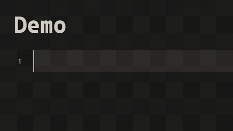
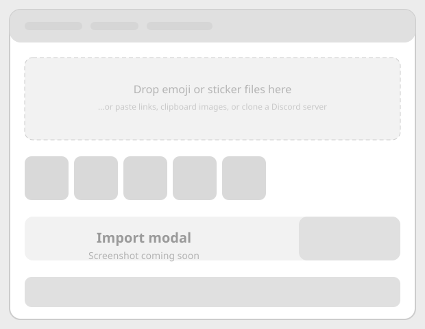
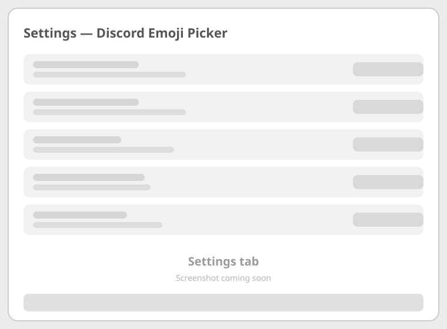

# Usage guide

This guide covers every feature of Discord Emoji Picker.

- [The picker](#the-picker)
- [Insert styles](#insert-styles)
- [Shortcodes](#shortcodes)
- [Sets](#sets)
- [Importing emojis & stickers](#importing-emojis--stickers)
- [Cloning from Discord servers](#cloning-from-discord-servers)
- [Theming the picker](#theming-the-picker)
- [Settings reference](#settings-reference)

## The picker

Open the picker with the smile ribbon icon or the **Open emoji & sticker picker** command (it needs an open note — the picker opens at your cursor).

- **Emoji / Sticker tabs** — switch between the two media types.
- **Search** — filters items by file name and path. Search the emoji tab to find emojis, the sticker tab for stickers.
- **Set rail** — the left column shows every set (subfolder) as a thumbnail. Click to jump to it; the highlighted pill follows your scroll position. The **history** icon at the top shows "recently used".
- **Insert** — click any image. It is inserted at the cursor using the configured [insert style](#insert-styles) and size.
- **Hover** — hovers show a larger preview with the file name.
- **Keyboard** — type to search, `Esc` closes, arrows move through the grid, `Enter` inserts.
- **Footer** — shows the current folder and how many items are visible.
- **Import shortcut** — the download button in the search bar opens the import modal.

The picker also opens with a pre-filled search when you trigger it from certain contexts (e.g. typing a shortcode that doesn't exist yet).

## Insert styles

| Style | What gets inserted | Notes |
| --- | --- | --- |
| Shortcode (`:name:`) | `:filename:` | Renders as the image in reading mode and (optionally) live preview. Easiest to edit and delete. |
| Embed | `![[folder/file.png\|size]]` | Native Obsidian embed. Size comes from the configured emoji/sticker size. |
| HTML | `` | Raw image tag; size baked in as inline CSS. |

Change the default in **Settings → Insert style**. Emojis and stickers always use their own configured sizes.

## Shortcodes

A shortcode is just `:filename:` — for example `:party-parrot:` inserts `discordemojipicker/emojis/party-parrot.gif`.

- **Typing** — start typing `:` in the editor and the suggest popup lists matching emojis and stickers; press `Enter` to complete.
- **Rendering** — shortcodes render as images in reading mode, and in live preview / source mode while **Render shortcodes in editor** is enabled (default: on).



- **Deleting** — hover the rendered image in the editor and click the **×** badge to remove it.
- **Searching** — search matches file names, so renaming a file renames the shortcode.

## Sets & categories

A *set* is a subfolder inside your emoji or sticker folder; images in the folder root form the general set. A *category* is an optional second subfolder inside a set, shown as a horizontal bar in the picker.

- Images in `discordemojipicker/emojis/animals/` belong to the **animals** set; images in `discordemojipicker/emojis/` belong to the general set.
- Images in `discordemojipicker/emojis/twemoji/faces/` belong to the **twemoji** set's **faces** category. In the picker, select the set in the vertical bar, then filter with the horizontal category bar.

The default folders are `discordemojipicker/emojis` and `discordemojipicker/stickers`, so all your media lives in one easy-to-find place. You can change them to any folder in the settings.
- **On first run**, the plugin seeds a small sample set — the **Cats** emoji set and the **Pets** sticker set — so you can try everything immediately. Delete them whenever you like.
- **Create / delete / rename / open** sets from **Settings → Emoji sets / Sticker sets**, or from the set dropdown in the import modal.
- Deleting a set moves every image in it to your trash and removes the folder — you can't undo it, so confirm carefully.

## Importing emojis & stickers

Run **Import emojis & stickers** to open the import modal. Everything you add lands in a **queue**, grouped by the target set and category; press **Import** to download them all at once, or **Cancel** mid-way to stop. Each item shows a ✓ or ✕ once it's processed, and a live progress counter tracks the run.



Use the **Import into** dropdown to pick the destination folder (emoji or sticker) and the **Set** dropdown to pick a subfolder — or type a new set name and press **Create**.

### Link tab

Paste any image URL. Discord emoji and sticker links are recognized automatically:

| Discord link | Detected as |
| --- | --- |
| `https://cdn.discordapp.com/emojis/<id>.png?name=...` | Emoji |
| `https://cdn.discordapp.com/stickers/<id>.png` | Sticker |
| `https://media.discordapp.net/stickers/<id>.gif` | Sticker (animated) |

The name is taken from the `?name=` parameter when present. You can also drag an image from a browser or Discord directly onto the dropzone.

### Discord tab

Bulk-clone everything from a server you're in. See [Cloning from Discord servers](#cloning-from-discord-servers).

### Clipboard tab

Paste copied images (from a screenshot tool, Discord, etc.) into the box — they're added to the queue and saved as files.

### Note tab

Insert any image already embedded in the current note (`![[...]]` links or `` tags) into the queue.

### Emoji pack tab

Download whole emoji sets from open-license packs and save them into the destination folder:

1. Pick a **pack** (Twemoji, Noto Emoji, or OpenMoji).
2. Choose how to organize the categories:
   - **Per pack** — each pack becomes its own set, with category subfolders inside (e.g. `discordemojipicker/emojis/twemoji/faces/`).
   - **Combined** — every pack (and the system emoji set) merges into one set with shared categories, named whatever you like (default **packs**).
3. Press **Add popular set** to queue the 211 most common emojis, or type names yourself (one per line, e.g. `smile`, `joy`, `:heart:` — Discord-style names like `sweat_smile` work too).
4. Press **Import** to download them all at once.

Categories are faces, gestures, hearts, symbols, nature, party, objects, travel, food, and animals. In the picker, pick a set in the vertical bar, then filter with the horizontal category bar. Custom names typed in the box import into a `custom` category of the set.

Each pack is fetched from the jsDelivr CDN and licensed for free reuse (Twemoji CC-BY 4.0, Noto Emoji Apache 2.0 / OFL, OpenMoji CC BY-SA 4.0).

**No internet?** Press **Add system emoji set (offline)** — it renders ~240 emojis locally from the emoji font on your device (e.g. Segoe UI Emoji on Windows) and queues them as images, no download needed. It respects the same **Category folders** setting.

Want more variety? Sites like [emoji.gg](https://emoji.gg/) host thousands of emoji packs you can download and drag into your emoji or sticker folders. Dragging in a whole folder of images auto-fills the **Set (subfolder)** box with the folder's name — change it before importing if you'd rather group them differently. An optional **Category (sub-subfolder)** box lets you place dragged or pasted images into a category of the chosen set.

## Cloning from Discord servers

> Requires a Discord token — see the warning in **Settings → Discord** and [Security & privacy](../README.md#security--privacy).

1. Get a token:
   - **Bot (recommended)**: create a bot at the [Discord developer portal](https://discord.com/developers/applications), add it to the servers you want to clone from, and use its token with **Token type → Bot**.
   - **User account**: your personal token works for servers you're in, but using it violates Discord's Terms of Service and may get your account flagged or banned.
2. Paste the token in **Settings → Discord Emoji Picker → Discord**, pick the token type, and press **Test connection**.
3. Open the import modal → **Discord tab → Clone a server**.
4. Press **Load servers**, pick a server, then **Load emojis & stickers**.
5. Tick the emojis and stickers you want (or select all) and press **Add selected**.

Emojis and stickers are downloaded from Discord's public CDN; animated stickers that only exist as Lottie JSON are skipped.

## Theming the picker

Choose a style in **Settings → Picker theme**:

- **Default** — follows your Obsidian theme.
- **Compact** — smaller panel, denser grid.
- **Vibrant** — accent-colored highlights.
- **Minimal** — flat, borderless.

Every color and size is a CSS variable, so you can restyle anything with a snippet:

```css
.gl-picker {
	--gl-accent: #e91e63;
	--gl-radius: 12px;
	--gl-grid-gap: 14px;
}
```

The variables live on `.gl-picker` — see `styles.css` for the full list.

## Settings reference



| Setting | What it does |
| --- | --- |
| Emoji folder | Vault folder with emoji images (default `discordemojipicker/emojis`); each subfolder becomes a set |
| Sticker folder | Vault folder with sticker images; each subfolder becomes a set |
| Emoji sets / Sticker sets | Create, delete, or open set folders |
| Insert style | Shortcode, embed, or HTML when clicking in the picker |
| Render shortcodes in editor | Show shortcode images in live preview / source mode |
| Emoji size / Sticker size | Grid size in the picker and inserted size |
| Picker theme | Default, Compact, Vibrant, or Minimal |
| Clear recently used | Empties the recently used row in the picker |
| Discord token / Token type / Test connection | Credentials for cloning from Discord servers |